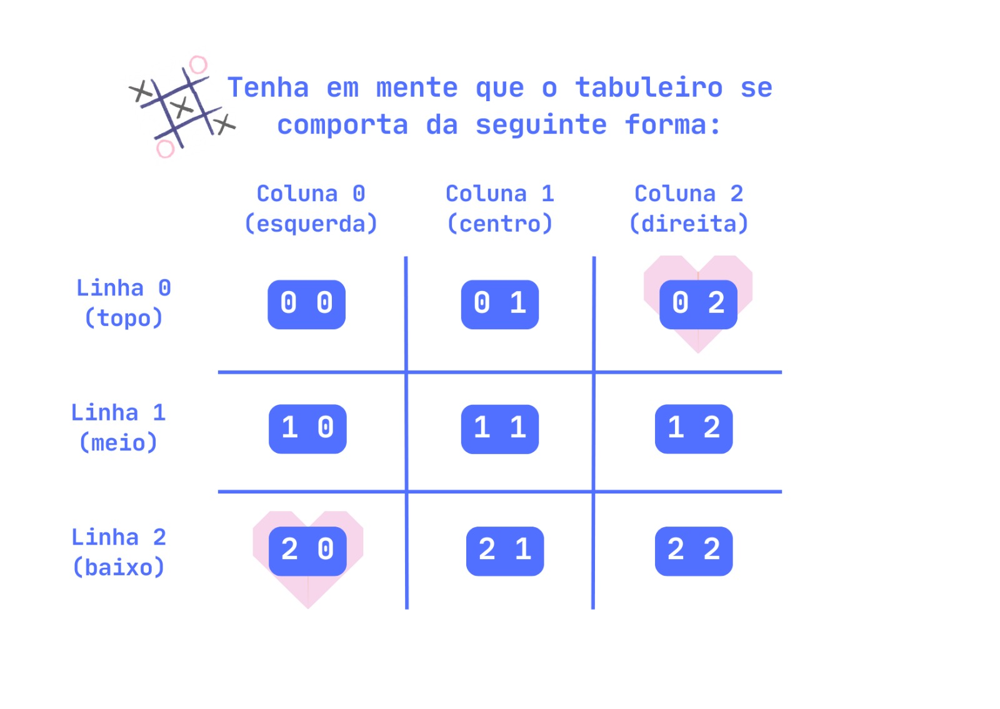
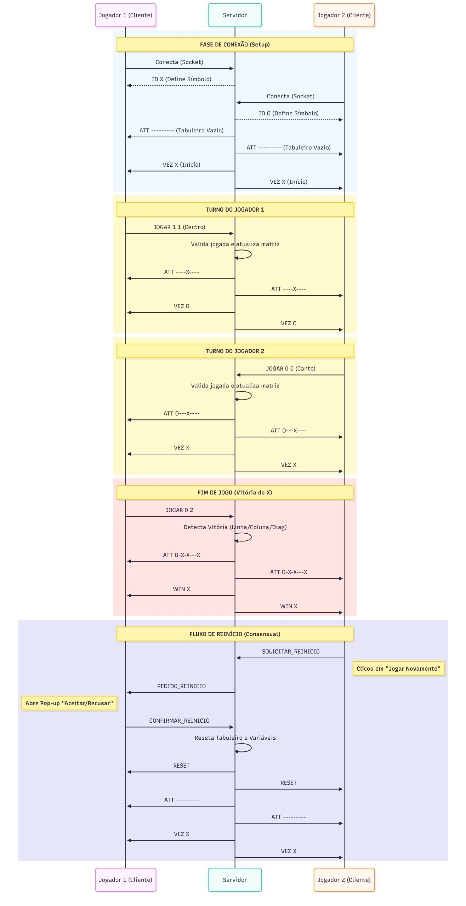

# Jogo da Velha Distribuído (Socket TCP)

## 1. Visão Geral e Propósito
Este projeto implementa uma versão multiplayer do clássico **Jogo da Velha**, baseada em um modelo **Cliente-Servidor**.  
O servidor centralizado em Python gerencia a lógica da partida, enquanto os clientes, desenvolvidos com **Pygame**, fornecem uma interface gráfica para interação dos jogadores.

O objetivo principal é demonstrar a **sincronização de estado em tempo real** entre dois jogadores distintos, garantindo consistência visual e lógica, usando sockets TCP.

O sistema conta com uma interface gráfica (GUI) desenvolvida em Pygame e um servidor multithread capaz de gerenciar a lógica da partida e o roteamento de mensagens.


## 2. Propósito do Software

* Implementar comunicação cliente-servidor usando **Sockets TCP**.
* Desenvolver um protocolo de camada de aplicação baseado em mensagens de texto.
* Garantir que a lógica do jogo permaneça centralizada no servidor e que os clientes apenas renderizem o estado.
* Demonstrar conceitos de **concorrência** (threads no servidor e cliente) e **UX responsiva** (pop-ups, turnos, pedidos de reinício).


## 3. Motivação da Escolha do Protocolo de Transporte (TCP)

Foi selecionado o protocolo TCP (Transmission Control Protocol) para a camada de transporte.

**Justificativa**: O Jogo da Velha é uma aplicação sensível ao estado (State-Sensitive).

1. **Confiabilidade:** Cada jogada deve ser entregue ao servidor sem perda. O TCP garante que nenhuma jogada seja perdida, evitando dessincronização. Não podemos tolerar a perda de pacotes. Se uma jogada for enviada e perdida na rede, o tabuleiro ficará dessincronizado, quebrando a integridade da partida.
2. **Ordenação:** A sequência de jogadas precisa ser preservada. Se o Jogador X jogar antes do Jogador O, o servidor processará nessa ordem.
3. **Tolerância à Latência:** A pequena latência do TCP não afeta um jogo de turnos. A consistência é mais importante que a velocidade.


## 4. Arquitetura e Componentes

A aplicação possui três arquivos principais:

* `server.py`: O "cérebro" da aplicação. Gerencia a matriz do tabuleiro, valida jogadas, detecta vitória ou empate e retransmite estados para os clientes. Possui um Console de Administração local (`r` = reiniciar, `q` = desligar servidor).
* `client.py`: Interface gráfica do jogador. Captura cliques do mouse e desenha o estado do tabuleiro enviado pelo servidor. Não processa regras do jogo localmente.
* `theme.py`: Arquivo de configuração contendo constantes de cores, dimensões e taxas de atualização (FPS), facilitando a manutenção visual.

### 4.1. Servidor
* Usa **threading**: cada cliente é atendido por uma thread separada.
* Mantém uma **fila de espera** e forma pares de jogadores automaticamente.
* Cada partida possui instância própria, armazenando:
  * Tabuleiro atual  
      
    *(Exemplo de como o tabuleiro é representado internamente como uma matriz 3x3)*
  * Símbolos dos jogadores (X/O)
  * Jogador da vez
* Controla todas as validações de jogadas e determina vencedor ou empate.

### 4.2. Cliente
* Apenas renderiza informações recebidas do servidor.
* Operação em **máquina de estados**:
  * **AGUARDANDO**: Conexão estabelecida, esperando o adversário.
  * **JOGANDO**: Recebe tabuleiro, permite clique se for sua vez.
  * **FIM DE JOGO**: Mostra pop-up de vitória, empate ou desconexão.
* Usa **threading** para manter GUI responsiva enquanto aguarda mensagens do servidor.
* Pop-ups para pedidos de reinício, confirmação e alertas de desconexão.


## 5. Requisitos Mínimos

**Servidor:**
* Python 3.x
* Biblioteca socket (nativa)
* Conexão de rede estável na porta 50000
* Permissões de firewall adequadas

**Cliente:**
* Python 3.x
* Biblioteca Pygame
* Conexão de rede com o servidor
* Permissões de firewall adequadas

Para instalar a dependência gráfica (Pygame):
```bash
pip install pygame
```


## 6. Instruções de Execução

### 6.1. Servidor
```bash
python server.py
```
* Escuta na porta 50000 em todas as interfaces.
* Comandos:
  * `r` + Enter → Reiniciar partida
  * `q` + Enter → Desligar servidor

### 6.2. Cliente
1. Configure o IP do servidor em `client.py`:
```python
client.connect(('IP_DO_SERVIDOR', 50000))
```
* `'127.0.0.1'` se for local
* IPv4 da máquina do servidor se for em rede local
2. Execute:
```bash
python client.py
```
3. Abra dois clientes para iniciar a partida multiplayer.


## 7. Protocolo da Camada de Aplicação

### 7.1. Formato e Transporte
* **Transporte:** TCP
* **Formato:** Strings codificadas em UTF-8
* **Mensagem:** `COMANDO <ARGUMENTOS>`

### 7.2. Mensagens Servidor → Cliente

| Mensagem | Descrição | Exemplo |
|----------|-----------|---------|
| `ID <S>` | Define o símbolo do jogador ao conectar. `<S>` pode ser X, O. | `ID X` (Você é o X)| 
| `ATT <T>` | Atualiza a matriz do tabuleiro. <T> é uma string de 9 caracteres representando as células. | `ATT X--O--X--` |
| `VEZ <S>` | Informa de quem é o turno atual. O cliente bloqueia cliques se não for sua vez. | `VEZ O` |
| `WIN <S>` | Informa o fim de jogo. `<S>` pode ser X, O ou V (Velha). | `WIN X` / `WIN V` |
| `RESET` | Comando para limpar o tabuleiro e remover pop-ups de vitória. | `RESET` |
| `PEDIDO_REINICIO` | Informa que o oponente solicitou reiniciar a partida. Abre um pop-up de confirmação. | `PEDIDO_REINICIO` |
| `REINICIO_NEGADO` | Informa que o oponente recusou o pedido de reinício. | `REINICIO_NEGADO` |
| `OPONENTE_DESCONECTOU` | Informa que o oponente desconectou-se da partida. | `OPONENTE_DESCONECTOU` |

### 7.3. Mensagens Cliente → Servidor

Mensagem  | Descrição  | Exemplo
--------- | --------- | ---------
`JOGAR <L> <C>` | Envia coordenada de clique (Linha, Coluna). O servidor valida se é legal. | `JOGAR 1 2`
`SOLICITAR_REINICIO` | Enviado quando o usuário clica em "Reiniciar". | `SOLICITAR_REINICIO`
`CONFIRMAR_REINICIO` | Enviado quando o usuário clica em "Aceitar" no pop-up de pedido. | `CONFIRMAR_REINICIO`
`NEGAR_REINICIO` | Enviado quando o usuário clica em "Recusar" no pop-up de pedido. | `NEGAR_REINICIO`

### 7.4. Fluxo de Jogo
1. Cliente conecta → recebe `ID`
2. Jogadores fazem jogadas alternadas → servidor envia `ATT` + `VEZ`
3. Fim de jogo:
   * Vitória → `WIN X` ou `WIN O`
   * Empate → `WIN V`
4. Pedido de reinício:
   * Cliente envia `SOLICITAR_REINICIO`
   * Oponente aceita → `CONFIRMAR_REINICIO`
   * Oponente recusa → `REINICIO_NEGADO`
5. Desconexão:
   * Servidor envia `OPONENTE_DESCONECTOU` ao cliente restante


## 8. Diagrama de Sequência




## 9. Autoria
Desenvolvido como requisito para a disciplina **Redes de Computadores I** por:

* Cibelle Sousa Rodrigues  
* David Júnio Mariano dos Santos
* Laisa Pereira França